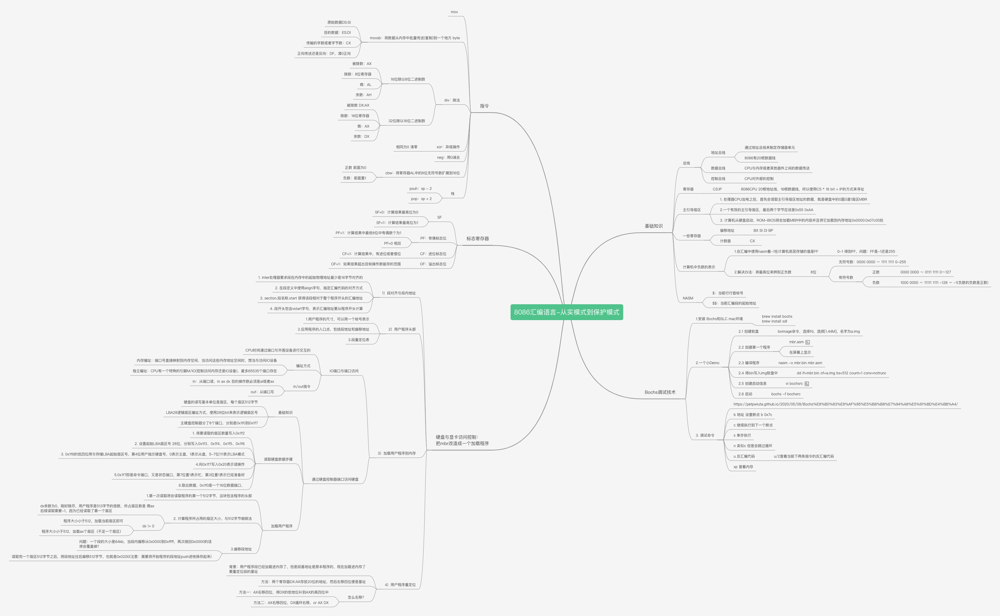
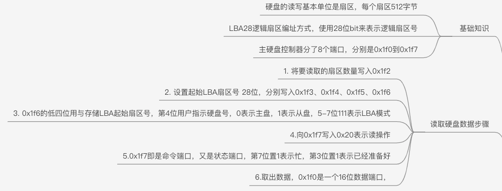
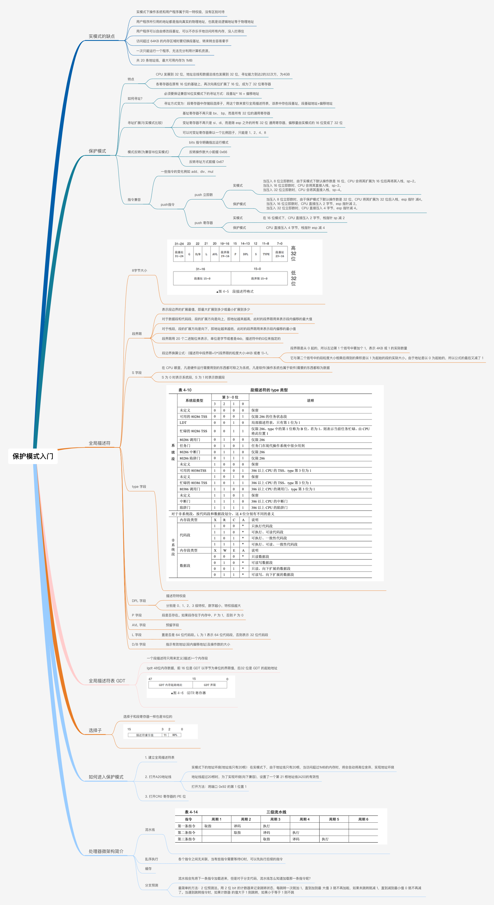

# TinyOs

阅读顺序：

- 《汇编语言第三版》 王爽
- 《x86汇编语言 从实模式到保护模式》 李忠 王晓波 余洁
- 《操作系统真象还原》郑纲

整个项目目标：写一个简单的操作系统，真正理解操作系统的运行原理，以及晦涩难懂的理论知识，本项目主要是以《操作系统真象还原》书籍为主导，其余两本书为辅助。本项目的章节顺序可能和书中顺序不太一样，主要是以目标为导向。

# 1. 实模式下的MBR加载器

整个章节的思维导图：



目标：在实模式下，写一个加载程序，将放在磁盘的程序代码加载进进内存中，并且执行。

#### 1.1 MBR

- MBR：**主引导记录**（Master Boot Record，缩写：MBR），又叫做**主引导扇区**，是计算机开机后访问硬盘时所必须要读取的首个扇区

> 1. 通电
> 2. 读取ROM里面的BIOS，用来检查硬件
> 3. 硬件检查通过
> 4. **BIOS根据指定的顺序，检查引导设备的第一个扇区（即主引导记录），加载在内存地址 0x7C00**
> 5. 主引导记录把操作权交给操作系统

#### 1.2 硬盘访问控制



#### 1.3 其他

详见代码注释

#### 1.4 启动

1. 创建硬盘(这里好像没法使用命令直接生成，所以这里使用交互，没有写入执行脚本里面)

```shell
/usr/local/bin/bximage -hd=10M -imgmode="flat"  -q hd3M.img
```

2. 启动脚本 run.sh

# 2. 进入保护模式

整个章节的思维导图：



目标：进入保护模式，入门保护模式，详见代码注释和思维导图

踩坑：mbr中加载扇区数cx值为1是不够的，因为loader.bin不止512字节

# 3.保护模式入门

三个目标：

- 获取内存大小
- 启动分页机制
- 加载内核

### 3.1 获取内存大小

获取方法见思维导图，详见代码注释

踩坑：书中的代码loader.s开头没有使用jmp跳转，也就是会将数据的部分当成代码执行，导致出错，项目里加上了jmp跳转到真正的指令部分，那么存放内存大小的地址将要➕3(jmp这条指令是3 byte)，所以最后调试的时候是xp 0xb03
